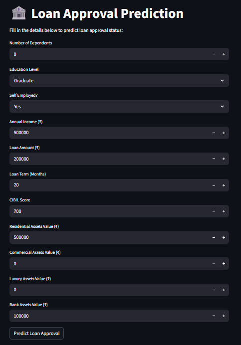
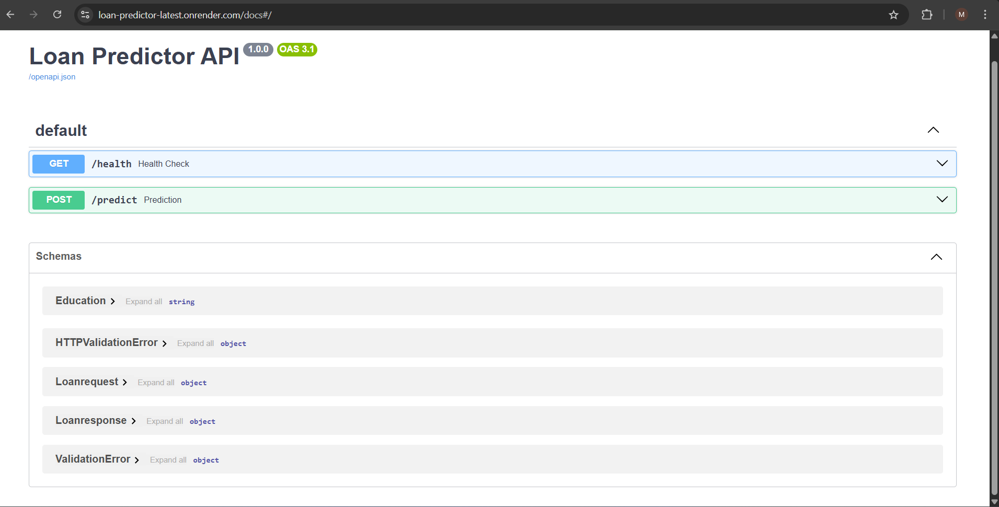

# 🏦 Loan Approval Predictor — End-to-End ML System

[](https://python.org)
[](https://fastapi.tiangolo.com)
[](https://streamlit.io)
[](https://scikit-learn.org)
[](https://docker.com)
[](https://dvc.org)
[](https://loan-predictor-latest.onrender.com/docs)
[](https://loan-predictor-3tpiubrtv7vcrr2q2uiqnz.streamlit.app)

> **A production-grade machine learning system that predicts loan approval outcomes using applicant financial profiles — featuring a FastAPI REST backend deployed on Render, a Streamlit web interface on Streamlit Cloud, and a fully reproducible ML pipeline tracked via DVC.**

---

## 🔗 Live Demos

| Component | URL |
|-----------|-----|
| 🌐 **Streamlit Web App** | [loan-predictor.streamlit.app](https://loan-predictor-3tpiubrtv7vcrr2q2uiqnz.streamlit.app) |
| ⚡ **FastAPI Swagger UI** | [loan-predictor-latest.onrender.com/docs](https://loan-predictor-latest.onrender.com/docs) |

---

## 📌 Business Problem

Financial institutions process thousands of loan applications every month. Manual review is slow, inconsistent, and operationally expensive. This system automates credit decisioning by training a machine learning model on historical applicant data to predict both **approval outcome** and **approval probability** — enabling faster, data-driven, risk-tiered lending decisions.

**Business value delivered:**
- Automates high-confidence approve/reject decisions, reducing manual workload
- Outputs probability scores for risk-tiered review of borderline applications
- Uses domain-informed feature engineering (`loan_to_income` ratio) to mirror how credit analysts evaluate risk
- Fully versioned pipeline ensures reproducibility and auditability

---

## 🖼️ Project Screenshots

### 🎛️ Streamlit Frontend — Interactive Prediction UI



> Applicants fill in 11 financial features through a clean, structured form. The app automatically computes the `loan_to_income` ratio before sending the request to the FastAPI backend — returning the prediction and probability in real time.

---

### ⚡ FastAPI Backend — Swagger / OpenAPI Docs



> The REST API is documented using OpenAPI 3.1 (Swagger UI). It exposes `GET /health` for uptime monitoring and `POST /predict` for inference. All request/response contracts are validated using Pydantic schemas (`Loanrequest`, `Loanresponse`).

---

## 🏗️ System Architecture

```
╔══════════════════════════════════════════════════════════════════╗
║                         END USER                                 ║
║               Opens Streamlit App in browser                     ║
╚══════════════════════════════╦═══════════════════════════════════╝
                               │
                               ▼
╔══════════════════════════════════════════════════════════════════╗
║            FRONTEND  —  Streamlit Cloud                          ║
║                                                                  ║
║   ┌─────────────────────────────────────────────────────────┐   ║
║   │  Input Form (11 features)                               │   ║
║   │  ➜ Compute loan_to_income = loan_amount / income_annum  │   ║
║   │  ➜ Build JSON payload                                   │   ║
║   │  ➜ POST https://loan-predictor-latest.onrender.com/     │   ║
║   │         predict                                         │   ║
║   └─────────────────────────────────────────────────────────┘   ║
╚══════════════════════════════╦═══════════════════════════════════╝
                               │  HTTPS  (JSON Request)
                               ▼
╔══════════════════════════════════════════════════════════════════╗
║            BACKEND  —  FastAPI  on  Render                       ║
║                                                                  ║
║   ┌──────────────┐    ┌────────────────────────────────────┐    ║
║   │ GET /health  │    │ POST /predict                      │    ║
║   │              │    │  1. Validate input (Pydantic)       │    ║
║   │ Returns:     │    │  2. Load model_pipe.pkl             │    ║
║   │ {"status":   │    │  3. Run inference pipeline          │    ║
║   │  "ok"}       │    │  4. Return status + probability     │    ║
║   └──────────────┘    └──────────────────┬─────────────────┘    ║
║                                          │                       ║
╚══════════════════════════════════════════╬═══════════════════════╝
                                           │  model_pipe.pkl
                                           ▼
╔══════════════════════════════════════════════════════════════════╗
║            ML PIPELINE  —  Scikit-Learn  (DVC Tracked)           ║
║                                                                  ║
║   Raw CSV  ──►  Data Ingestion  ──►  Feature Engineering         ║
║                                           │                      ║
║                                           ▼                      ║
║              ┌────────────────────────────────────────┐          ║
║              │         ColumnTransformer               │          ║
║              │  ┌──────────────┐  ┌─────────────────┐ │          ║
║              │  │StandardScaler│  │  OrdinalEncoder  │ │          ║
║              │  │ (numerical)  │  │  (categorical)   │ │          ║
║              │  └──────────────┘  └─────────────────┘ │          ║
║              └───────────────────┬────────────────────┘          ║
║                                  │                               ║
║                                  ▼                               ║
║              ┌────────────────────────────────────────┐          ║
║              │      Classifier (Gradient Boosting)     │          ║
║              │   Output: Approved / Rejected + P(y)   │          ║
║              └────────────────────────────────────────┘          ║
║                                  │                               ║
║                                  ▼                               ║
║              model_pipe.pkl  ◄──  DVC  ◄──  Tracked in Git       ║
╚══════════════════════════════════════════════════════════════════╝
                                   │
                                   ▼
╔══════════════════════════════════════════════════════════════════╗
║         RESPONSE  →  Back to Streamlit UI                        ║
║  { "loan_approval_status": "Approved", "probablity": 0.94 }      ║
╚══════════════════════════════════════════════════════════════════╝
```

---

## ✨ Key Features

- **Decoupled Architecture** — ML inference backend and web frontend are independently deployed and scalable
- **Production REST API** — FastAPI with Pydantic validation, OpenAPI 3.1 docs, deployed on Render
- **Interactive Web App** — Streamlit frontend with real-time prediction and probability output
- **Reproducible ML Pipeline** — All data, model, and metric versions tracked via DVC
- **Feature Engineering** — `loan_to_income` ratio derived at inference time to ensure train-serve consistency
- **Containerized** — Dockerfile for fully reproducible local and cloud deployments
- **Structured Logging** — Application-level logging to `logs/info.log` for observability

---

## 🗂️ Project Structure

```
loan-predictor/
│
├── assets/                         # Screenshots for README
│   ├── api.png                     # FastAPI Swagger UI screenshot
│   └── ui.png                      # Streamlit app screenshot
│
├── app/                            # FastAPI application
│   ├── config.py                   # App configuration & settings
│   ├── main.py                     # Routes, startup, middleware
│   ├── model.py                    # Model loading & inference logic
│   └── schema.py                   # Pydantic request/response schemas
│
├── data/
│   └── home/
│       └── loan_approval_dataset.csv
│
├── data_rerfence/
│   └── reference.txt               # Data dictionary & feature notes
│
├── frontend/
│   └── app.py                      # Streamlit web application
│
├── logs/
│   └── info.log                    # Runtime application logs
│
├── models/
│   └── model_pipe.pkl              # Serialized Scikit-Learn pipeline
│
├── notebook/
│   └── loan_predictor.ipynb        # EDA, feature engineering, experiments
│
├── reports/
│   └── figures/                    # Evaluation plots & charts
│
├── src/
│   ├── data/
│   │   └── data_ingestion.py       # Data loading & train/test split
│   ├── evaluation/
│   │   └── model_evaluation.py     # Metrics, threshold analysis
│   └── model/
│       └── model_pipe.py           # Pipeline definition & training
│
├── uttils/
│   └── logger.py                   # Centralized logging setup
│
├── .dvc/                           # DVC configuration
├── .dvcignore
├── .gitignore
├── dockerfile                      # Container definition
├── dvc.lock                        # Reproducible pipeline lock file
├── dvc.yaml                        # DVC pipeline stage definitions
├── requirements.txt                # Streamlit frontend dependencies
├── requirements_prod.txt           # Docker / production API dependencies
├── requirements_proj.txt           # Full project dependencies (training, EDA, DVC)
└── runtime.txt                     # Python runtime specification
```

---

## 📊 Dataset & Features

**Dataset:** Loan Approval Dataset — ~4,000 real-world applicant records

| Feature | Type | Description |
|---------|------|-------------|
| `no_of_dependents` | int | Number of financial dependents |
| `education` | categorical | Graduate / Not Graduate |
| `self_employed` | categorical | Employment type (Yes / No) |
| `income_annum` | float | Annual income (₹) |
| `loan_amount` | float | Requested loan amount (₹) |
| `loan_term` | int | Repayment period in months |
| `cibil_score` | int | Credit bureau score (300–900) |
| `residential_assets_value` | float | Value of residential property (₹) |
| `commercial_assets_value` | float | Value of commercial property (₹) |
| `luxury_assets_value` | float | Value of luxury assets (₹) |
| `bank_asset_value` | float | Bank deposits and liquid assets (₹) |
| `loan_to_income` ⚙️ | float | **Engineered** — `loan_amount / income_annum` |

**Target:** `loan_status` → `Approved` / `Rejected`

### Sample Records

| loan_id | dependents | education | self_employed | income (₹) | loan (₹) | term | CIBIL | status |
|---------|-----------|-----------|--------------|------------|---------|------|-------|--------|
| 0 | 2 | Graduate | No | 96,00,000 | 29,90,000 | 12 | 778 | ✅ Approved |
| 1 | 0 | Not Graduate | Yes | 41,00,000 | 12,20,000 | 8 | 417 | ❌ Rejected |
| 2 | 3 | Graduate | No | 91,00,000 | 29,70,000 | 20 | 506 | ❌ Rejected |
| 3 | 4 | Graduate | No | 82,00,000 | 30,70,000 | 8 | 467 | ❌ Rejected |
| 4 | 5 | Not Graduate | Yes | 98,00,000 | 24,20,000 | 20 | 382 | ❌ Rejected |

---

## 🤖 ML Pipeline (DVC Stages)

```
Stage 1 ── Data Ingestion
           └── src/data/data_ingestion.py
                ├── Load loan_approval_dataset.csv
                ├── Validate schema & handle nulls
                └── Stratified train / test split

Stage 2 ── Feature Engineering
           └── Compute loan_to_income = loan_amount / income_annum

Stage 3 ── Model Training
           └── src/model/model_pipe.py
                ├── ColumnTransformer
                │    ├── StandardScaler      → numerical features
                │    └── OrdinalEncoder      → education, self_employed
                └── Gradient Boosting Classifier

Stage 4 ── Evaluation
           └── src/evaluation/model_evaluation.py
                ├── Accuracy, Precision, Recall, F1
                ├── ROC-AUC curve
                └── Confusion matrix → reports/figures/

Stage 5 ── Serialize
           └── models/model_pipe.pkl   ← DVC tracked artifact
```

---

## 🚀 Quick Start

### Option 1 — Docker (Recommended)

```bash
git clone https://github.com/<your-username>/loan-predictor.git
cd loan-predictor

docker build -t loan-predictor .
docker run -p 8000:8000 loan-predictor

# API available at: http://localhost:8000/docs
```

### Option 2 — Run API Locally (without Docker)

```bash
python -m venv venv
source venv/bin/activate          # Windows: venv\Scripts\activate

# Install production/API dependencies
pip install -r requirements_prod.txt
uvicorn app.main:app --reload --port 8000
```

### Option 3 — Run Streamlit Frontend

```bash
# Install Streamlit dependencies
pip install -r requirements.txt
streamlit run frontend/app.py
```

### Option 4 — Reproduce Full ML Pipeline

```bash
# Install full project dependencies (training, EDA, DVC pipeline)
pip install -r requirements_proj.txt
dvc pull        # Pull tracked data & models from remote
dvc repro       # Re-run all pipeline stages
dvc metrics show
```

---

## 📡 API Reference

**Base URL:** `https://loan-predictor-latest.onrender.com`

### `GET /health`

```json
{ "status": "ok" }
```

### `POST /predict`

**Request Body (`Loanrequest` schema):**

```json
{
  "no_of_dependents": 2,
  "education": "Graduate",
  "self_employed": "No",
  "income_annum": 9600000,
  "loan_amount": 2990000,
  "loan_term": 12,
  "cibil_score": 778,
  "residential_assets_value": 24000000,
  "commercial_assets_value": 1760000,
  "luxury_assets_value": 2270000,
  "bank_asset_value": 800000,
  "loan_to_income": 0.311
}
```

**Response (`Loanresponse` schema):**

```json
{
  "loan_approval_status": "Approved",
  "probablity": 0.94
}
```

| Status Code | Meaning |
|-------------|---------|
| `200` | Prediction successful |
| `422` | Validation error — check field types or missing fields |
| `500` | Internal server error |

---

## 📈 Model Performance

| Metric | Score |
|--------|-------|
| **Accuracy** | ~98% |
| **Precision** | ~97% |
| **Recall** | ~98% |
| **ROC-AUC** | ~0.99 |

> *Evaluated on a stratified held-out test set. CIBIL score and `loan_to_income` ratio are the strongest predictors of approval outcome.*

---

## 🛠️ Tech Stack

| Layer | Technology |
|-------|-----------|
| **Language** | Python 3.10+ |
| **ML / Data** | Scikit-Learn, Pandas, NumPy |
| **Pipeline Tracking** | DVC (data + model versioning) |
| **API Backend** | FastAPI, Uvicorn, Pydantic |
| **Frontend** | Streamlit |
| **Containerization** | Docker |
| **API Deployment** | Render |
| **Frontend Deployment** | Streamlit Cloud |
| **Logging** | Python `logging` module |

---

## 🎯 What This Project Demonstrates

| Skill | Implementation |
|-------|----------------|
| **ML Pipeline Engineering** | Modular, reproducible pipeline with DVC stage tracking |
| **REST API Development** | Type-safe FastAPI backend with full OpenAPI 3.1 documentation |
| **Software Engineering** | Clean separation of `data → model → api → frontend` layers |
| **Feature Engineering** | Domain-informed `loan_to_income` computed consistently at train and inference time |
| **Containerization** | Dockerized backend for reproducible deployment |
| **End-to-End Deployment** | API on Render + frontend on Streamlit Cloud, fully live and accessible |

---

## 📂 Other Portfolio Projects

| Project | Stack | Highlights |
|---------|-------|-----------|
| [🏥 Health Insurance MLOps Predictor](https://github.com/<username>/health-insurance-mlops) | DVC · MLflow · Docker · AWS ECR/S3 · GitHub Actions | Full MLOps pipeline with CI/CD, cloud deployment, and Prometheus/Grafana monitoring |
| [📱 Telecom Churn Predictor](https://github.com/<username>/telecom-churn-predictor) | Streamlit · SHAP · Groq LLM | Explainable churn prediction with SHAP visualizations and LLM-generated plain-English summaries |
| [📄 HR Policy RAG System](https://github.com/<username>/hr-policy-rag) | LangChain 0.3+ · ChromaDB · RAGAS | Production RAG pipeline with LCEL chains, semantic retrieval, and RAGAS-based evaluation |

---

## 👤 Author

**Md Shoaib**  
🔗 [LinkedIn](https://linkedin.com/in/your-profile) · [GitHub](https://github.com/your-username)

---

## 📄 License

This project is licensed under the MIT License. See [LICENSE](./LICENSE) for details.
